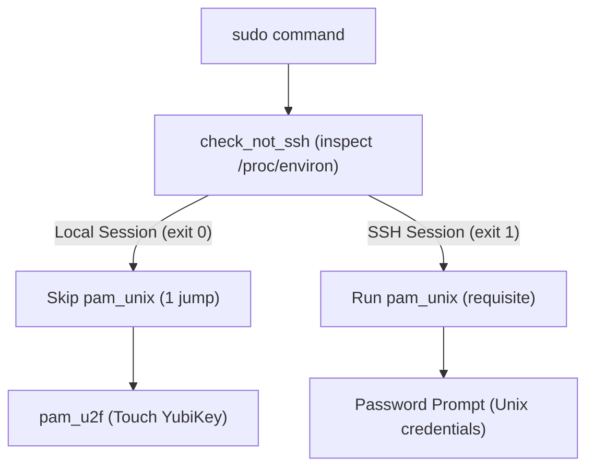
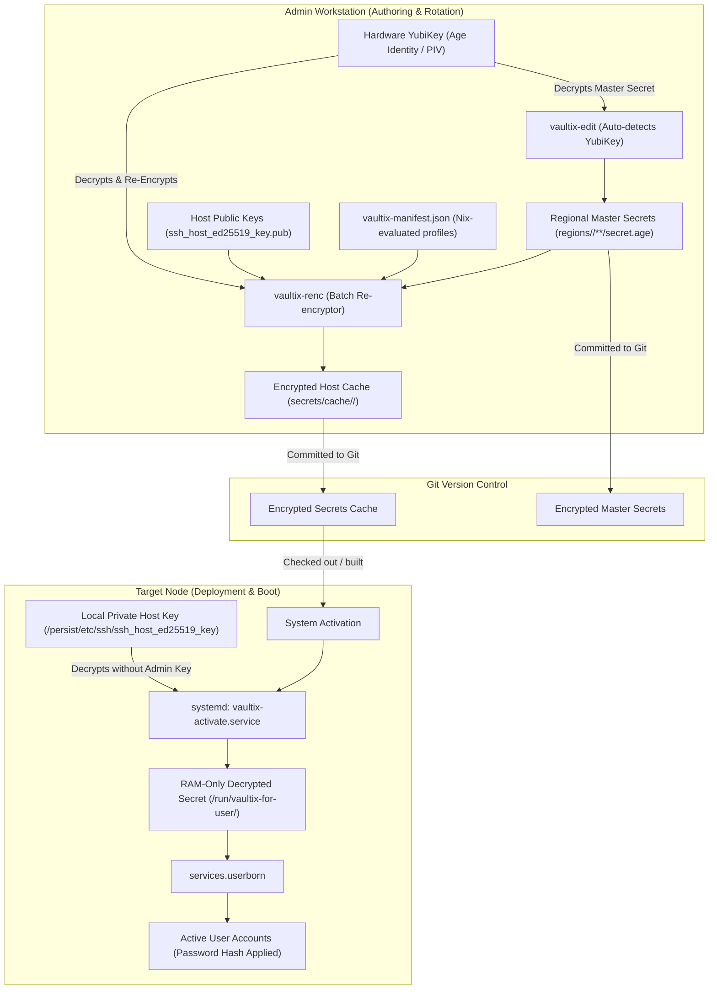

# r3x - René Jochum's NixOS Environment

Fleet infrastructure, system configurations, and desktop environments built using [Den](https://github.com/denful/den) / [Dendritic](https://dendritic.oeiuwq.com) architecture, [Vic's vix](https://github.com/vic/vix), and deep hardware-backed secret management powered by [Vaultix](https://github.com/milieuim/vaultix).

This configuration manages multi-region baremetal machines, Incus virtual machines, and LXC development containers with zero-trust secret orchestration, hardware YubiKey Age encryption, offline per-host secret caching, and modular recipes.

> [!WARNING]
> **AI-Assisted Codebase**: This repository and its configurations are heavily written, refactored, and maintained using AI coding tools. Review configurations, Nix modules, and scripts carefully before adapting or applying them to your own infrastructure.

---

## Architecture & Principles

- **Dendritic Design via [Den](https://github.com/denful/den)**: Composable system aspects, roles, and parametric policies separating system concerns from user dotfiles.
- **Hardware-Enforced Secret Management via [Vaultix](https://github.com/milieuim/vaultix)**: Zero-trust secret lifecycle combining physical YubiKey Age identities (`age-plugin-yubikey`), declarative manifest compilation, pre-computed offline host secret caching, and race-free early-boot Userborn password provisioning.
- **Unflaked Inputs**: Dependencies are declared with [`flake-file.inputs`](https://github.com/vic/flake-file), pinned via [npins](https://github.com/andir/npins), and loaded at evaluation time using [with-inputs](https://github.com/vic/with-inputs) and [flake-parts](https://github.com/hercules-ci/flake-parts).
- **Two Den Namespaces**:
  - `r3x`: Reusable infrastructure modules, system roles, desktop environments (COSMIC, Niri), disk partitioning schemes (Btrfs, Impermanence), security, and services.
  - `users`: User configurations, dotfiles, desktop settings, applications, and home-manager integration (e.g. [`modules/users/r3j0`](modules/users/r3j0)).

---

## Directory Organization

```
.
├── Justfile               # Entrypoint delegating to modular just/*.just recipes
├── just/
│   ├── local.just         # Local machine build, switch, boot, and install recipes
│   ├── remote.just        # Remote Incus deployments and SSH host key rotation
│   └── u2f.just           # U2F / FIDO2 authentication testing and enrollment
├── modules/
│   ├── den.nix            # Declares the 'r3x' and 'users' namespaces
│   ├── defaults.nix       # Base schema defaults and settings options
│   ├── hosts.nix          # Dynamic host discovery and user mapping
│   ├── r3x/               # Shared aspects: roles, desktops, disks, services
│   ├── templates/         # Host templates: desktop, desktop-vm, devcontainer, live
│   └── users/             # User aspect definitions and configurations
├── packages/              # Custom derivations (vaultix-manifest, vaultix-edit, vaultix-renc)
├── regions/               # Region-scoped hosts, settings, secrets, and identities
│   └── home/
│       ├── settings.json  # Regional settings (region, domain, default users)
│       ├── identities/    # Hardware-backed Age identities (YubiKey public recipients)
│       ├── hosts/         # Host-specific settings, keys, and OpenTofu variables
│       │   ├── dev01/     # LXC devcontainer
│       │   ├── w2020/     # Baremetal workstation
│       │   └── w2020-vm/  # Incus desktop VM
│       └── users/         # Regional secrets (e.g. shadow.age)
└── secrets/cache/         # Host-encrypted secret caches (enables offline boot & rebuilds)
```

---

## Regional & Host Configuration

Host declarations live under `regions/<region>/hosts/<host>/`.

1. **Regional Defaults (`regions/<region>/settings.json`)**:
   Sets region-wide defaults inherited by all hosts in that region:

   ```json
   {
     "region": "home",
     "domain": "home.jochum.dev",
     "users": ["r3j0"]
   }
   ```

2. **Host Settings (`regions/<region>/hosts/<host>/settings.json`)**:
   Overrides template, disk devices, or user lists per machine:
   ```json
   {
     "template": "desktop",
     "disk": "/dev/nvme0n1",
     "users": ["r3j0"]
   }
   ```

### Available Host Templates

| Template       | Role                  | Notes                                                               |
| -------------- | --------------------- | ------------------------------------------------------------------- |
| `desktop`      | Baremetal workstation | Btrfs, COSMIC Desktop, Niri, PipeWire, NixOS facter, YubiKey, Incus |
| `desktop-vm`   | Incus VM Desktop      | Virtualized desktop with graphical support and system tools         |
| `devcontainer` | Incus LXC Container   | Fast, lightweight container with developer tools and SSH            |
| `live`         | Installation ISO      | Bootable installer with ZFS, facter, and hardware detection         |

### Current Hosts

| Target          | Region | Host       | Template       | Platform     | Users                    |
| --------------- | ------ | ---------- | -------------- | ------------ | ------------------------ |
| `home-w2020`    | `home` | `w2020`    | `desktop`      | x86_64-linux | `r3j0`                   |
| `home-w2020-vm` | `home` | `w2020-vm` | `desktop-vm`   | x86_64-linux | `r3j0`                   |
| `home-dev01`    | `home` | `dev01`    | `devcontainer` | x86_64-linux | `r3j0`, `r3j0-2`         |
| `live`          | —      | `live`     | `live`         | x86_64-linux | `nixos`                  |

---

## User Management (`settings.users`)

Host configurations specify users and their groups directly in `settings.json`:

```json
"users": {
  "r3j0": {
    "groups": ["wheel", "networkmanager"]
  }
}
```

- **Group Control**: Groups such as `wheel` (for `sudo` access) and `networkmanager` are configured explicitly per user per host rather than relying on list order.
- **U2F Authentication**: `/etc/u2f_mappings` dynamically aggregates credentials from `modules/users/<user>/u2f_mappings` for all users active on the host.

---

## YubiKey & Authentication Management

Hardware security keys (YubiKeys) serve two core functions in this environment:

1. **PAM U2F / FIDO2 Authentication**: Passwordless `sudo`, display manager login (`cosmic-greeter`), screen unlock, and polkit authorization.
2. **Age Hardware Identity Decryption**: Decrypting host private keys, passwords, and Vaultix secrets without private keys stored on disk.

### Sudo Authentication (Local vs. SSH)

The PAM configuration in [`modules/r3x/yubikey.nix`](modules/r3x/yubikey.nix) implements context-aware privilege escalation:



- **Local `sudo` (Passwordless Touch)**:
  - The custom PAM helper `check-not-ssh` inspects the process hierarchy and environment variables (`SSH_CONNECTION`, `SSH_CLIENT`, `SSH_TTY`, `sshd` parent processes).
  - On local sessions, it exits `0`. With `[success=1 default=ignore]`, PAM skips the standard `pam_unix` password prompt and jumps directly to `pam_u2f`.
  - The terminal cues you (`Please touch the device.`), and tapping your YubiKey completes authentication instantly.
- **`sudo` over SSH (Password Fallback)**:
  - When invoked from an SSH session, `check-not-ssh` detects the SSH environment and exits `1`.
  - The skip is bypassed, and `pam_unix` is evaluated with `[success=done default=die]`.
  - The user is prompted for their Unix password instead of waiting for a physical key touch on the remote machine. If password verification succeeds, authentication is immediately complete (`success=done`).

### Session Auto-Lock on YubiKey Removal

A custom udev rule in [`modules/r3x/yubikey.nix`](modules/r3x/yubikey.nix) monitors the USB bus for YubiKey disconnect events:

```udev
ACTION=="remove", ENV{ID_BUS}=="usb", ENV{ID_VENDOR_ID}=="1050", RUN+="loginctl lock-sessions"
```

Unplugging your YubiKey immediately triggers `loginctl lock-sessions`, securing the workstation when stepping away.

### Greeter, Login, and Polkit Integration

YubiKey U2F authentication is enabled with `sufficient` control across all authentication entry points:

- **COSMIC Greeter**: Graphical login screen accepts YubiKey touch (configured in [`modules/r3x/services/cosmic-greeter.nix`](modules/r3x/services/cosmic-greeter.nix)).
- **Console Login**: TTY login accepts key touch.
- **Polkit-1**: Graphical privilege escalation dialogs prompt for YubiKey touch.
- **Swaylock**: Lock screen unlock via touch.

### U2F Key Enrollment & Verification

U2F credential mappings are stored declaratively at `modules/users/<user>/u2f_mappings` and built into `/etc/u2f_mappings` in the Nix store.

1. **Enroll Primary / New Key**:

   ```bash
   # Enrolls a key for the specified user (defaults to current user)
   just enroll-u2f [user]
   ```

   This invokes `pamu2fcfg -o pam://host -i pam://host -u <user>` and writes the mapping record.

2. **Add Backup / Secondary Keys**:
   To add a second key to an existing user without overwriting:

   ```bash
   # Generate credential string for the second key
   pamu2fcfg -n -o pam://host -i pam://host -u <user>
   ```

   Append the output as a colon-separated credential to `modules/users/<user>/u2f_mappings`:

   ```
   <username>:<credential_1>:<credential_2>
   ```

3. **Verify Configuration**:
   ```bash
   just test-u2f [host]
   ```
   Validates mapping syntax (decodes base64 keys, verifies ES256 COSE algorithm), verifies the Nix store path, and queries connected FIDO2 tokens.

### Hardware SSH Keys (FIDO2 / `ssh-sk`) & Proton Pass

This environment supports OpenSSH FIDO2 hardware keys (`sk-ssh-ed25519@openssh.com`) alongside Proton Pass (`pass-cli ssh-agent`):

- **How `ssh-sk` Works with Proton Pass**:
  - Proton Pass manages software keys stored in your cloud vault via `SSH_AUTH_SOCK` (`~/.ssh/proton-pass-agent.sock`).
  - For `ssh-sk` keys, the private key is physically trapped inside the YubiKey's secure element. OpenSSH accesses the YubiKey directly via `libfido2` (`/dev/hidraw*`).
  - OpenSSH client configuration in [`modules/users/r3j0/default.nix`](modules/users/r3j0/default.nix) automatically offers `~/.ssh/id_ed25519_sk` alongside keys loaded in the Proton Pass agent. Both work seamlessly side-by-side without contention.

- **Enrolling Primary and Secondary (Backup) Keys**:
  Each physical YubiKey possesses an independent secure element; private keys cannot be duplicated across keys. Therefore, each physical YubiKey produces a separate public key that is added to `modules/users/<user>/authorized_keys`:

  ```bash
  # 1. Plug in Key 1 (Primary)
  just enroll-ssh-sk [user] id_ed25519_sk

  # 2. Plug in Key 2 (Backup)
  just enroll-ssh-sk [user] id_ed25519_sk_2
  ```
  - Both public keys are appended to `modules/users/<user>/authorized_keys` so that any target machine in your fleet will accept either key.
  - OpenSSH client is preconfigured in `modules/users/<user>/default.nix` to iterate over `id_ed25519_sk`, `id_ed25519_sk_2`, and `id_ed25519_sk_backup`. If Key 2 is plugged in, OpenSSH automatically tries Key 2 when Key 1 is absent.
  - `-O resident`: Stored internally on the YubiKey flash memory (can be fetched on any new machine via `ssh-keygen -K`).
  - **Touch-Only Verification**: Keys are enrolled without `-O verify-required`, requiring only a physical touch on your YubiKey for each Git commit or SSH session (no PIN required during use).

- **Fetching Resident Keys on a New Machine**:
  ```bash
  # Downloads resident key handles from whichever YubiKey is currently connected to ~/.ssh/
  just fetch-ssh-sk
  ```
  No need to copy key files between machines—simply plug in either YubiKey and run `just fetch-ssh-sk` or load it directly into memory with `ssh-add -K`.

### Hardware-Backed Age Identities (`age-plugin-yubikey`)

Vaultix and host secrets use [`age-plugin-yubikey`](https://github.com/str4d/age-plugin-yubikey) for hardware-backed decryption:

- **Identity Files (`regions/<region>/identities/`)**:
  Files such as `r3j0-1.txt` and `r3j0-2.txt` declare the YubiKey serial, slot, and public Age recipient (`age1yubikey1...`).
- **Dynamic Serial Detection**:
  When running `vaultix-edit` or `vaultix-renc`, the script queries `ykman list` to detect which physical YubiKey is currently plugged into the system and selects the corresponding identity file automatically.
- **Provisioning a New YubiKey for Age**:
  ```bash
  # Generate an age identity on a plugged-in YubiKey
  age-plugin-yubikey > regions/<region>/identities/<user>-<slot>.txt
  ```

---

## Secret Management with Vaultix

Secret management in `r3x` is built around a deep integration with [Vaultix](https://github.com/milieuim/vaultix), establishing a zero-trust, hardware-enforced secret lifecycle. Unlike traditional setups where private keys reside on developer filesystems or remote servers require live admin tokens to deploy, `r3x` combines:

1. **Hardware-Backed Master Identities**: Master secrets are encrypted exclusively to hardware security keys via [`age-plugin-yubikey`](https://github.com/str4d/age-plugin-yubikey). No private master keys ever exist on disk.
2. **Pre-Computed Per-Host Encrypted Caching (`secrets/cache/<host>/`)**: Secrets are compiled into host-specific, pre-encrypted payloads bound to each target machine's unique public SSH host key (`ssh_host_ed25519_key.pub`).
3. **Completely Decoupled, Offline Deployments**: Target hosts boot, build, and switch independently using only their local private host key (`/persist/etc/ssh/ssh_host_ed25519_key`). The admin's YubiKey is **never** required during deployment or boot.
4. **Early-Boot Userborn Integration (`services.userborn`)**: Password hashes and system credentials are decrypted into memory (`/run/vaultix-for-user/`) during Stage 1 initialization, cleanly provisioning accounts before any login service starts without plaintext hashes touching Git or the Nix store.
5. **Integrated Custom Tool Suite (`packages/vaultix/`)**: Native tools (`vaultix-manifest`, `vaultix-edit`, `vaultix-renc`) automate YubiKey hardware detection, regional recipient aggregation, and automated cache synchronization.

### Cryptographic Lifecycle & Pipeline



### Core Architecture & Advantages

#### 1. Hardware YubiKey Enforcement (`age-plugin-yubikey`)
Every regional identity file in `regions/<region>/identities/` (e.g. `r3j0-1.txt`, `r3j0-2.txt`) references a physical YubiKey slot. When editing secrets or re-encrypting caches, `vaultix-edit` and `vaultix-renc` automatically query `ykman list` to detect which physical YubiKey is connected and immediately select the matching identity. Plaintext private keys are never stored on any developer or CI workstation.

#### 2. Declarative Manifest Compiler (`vaultix-manifest`)
Defined in [`packages/vaultix/manifest.nix`](packages/vaultix/manifest.nix), `vaultix-manifest` evaluates the full NixOS configuration tree across all regions. It derives a consolidated `vaultix-manifest.json` containing:
- All non-ISO nodes with `vaultix.enable = true`
- Individual host secret subscriptions and relative file paths
- Secret profiles defining placeholder paths and early-boot requirements
- Regional identities and recipient public keys

#### 3. Air-Gapped / Decoupled Host Activation
Traditional secret managers often require forwarding the admin's agent or keeping decryption keys accessible over the network. With Vaultix's caching model:
- The administrator compiles the cache ahead of time via `vaultix-renc`.
- Secrets in `secrets/cache/<host>/` are encrypted strictly to that specific host's `ssh_host_ed25519_key.pub`.
- The target machine decrypts its own secrets locally at boot via `/persist/etc/ssh/ssh_host_ed25519_key`.
- Deployments, reboots, and automated rebuilds happen seamlessly even if the administrator is offline or the YubiKey is unplugged.

#### 4. Race-Free User Provisioning via Userborn
NixOS uses `services.userborn` to declaratively provision users and groups. Vaultix integrates natively via `beforeUserborn`:
```nix
users.users."r3j0".hashedPasswordFile = config.vaultix.secrets.shadow_r3j0.path;

vaultix = {
  secrets.shadow_r3j0 = {
    file = shadowPath;
  };
  beforeUserborn = [ "shadow_r3j0" ];
};
```
`systemd.services.vaultix-activate` runs before `userborn.service`, ensuring `/run/vaultix-for-user/shadow_r3j0` is decrypted into a RAM disk before the OS creates or verifies user accounts.

---

### Vaultix Tooling Suite (`packages/vaultix/`)

The repository includes a custom wrapper suite providing effortless secret editing, batch re-encryption, and key rotation:

#### `vaultix-edit` — Smart Secret Editor
Interactive secret editor with automatic hardware detection and cache re-encryption:

```bash
# Interactive editing (auto-detects region and connected YubiKey)
vaultix-edit [region] <secret-file>

# Pipe directly from stdin (ideal for automation or pasting tokens)
echo "my-secret-password" | vaultix-edit home users/r3j0/secrets/shadow.age

# Edit without immediately triggering cache re-encryption
vaultix-edit home <file> --no-renc
```
- **Auto-Detection**: Infers the region from file paths or prompts interactively via `fzf` when omitted.
- **Auto-Renc**: When a secret file is modified, `vaultix-edit` detects content changes and automatically re-encrypts the caches for all hosts consuming that secret.

#### `vaultix-renc` — Batch Cache Re-encryptor
Re-encrypts all cached secrets for hosts across one or more regions:

```bash
# Re-encrypt secret caches for all hosts in all regions
vaultix-renc

# Re-encrypt caches for a specific region
vaultix-renc home

# Re-encrypt caches for hosts consuming a specific secret
vaultix-renc home shadow.age
```

#### `just rotate-ssh` — Automated Host Key Rotation
Rotates host SSH keys, updates Age recipients, and re-encrypts the Vaultix cache in one command:

```bash
# Rotate both ed25519 and rsa host keys for a host
just rotate-ssh home dev01

# Rotate only ed25519 host key
just rotate-ssh home dev01 ed25519
```
1. Generates fresh host private and public keys.
2. Encrypts the private keys into `ssh_host_<type>_key.age` via `vaultix-edit`.
3. Runs `vaultix-renc` to rebuild the host cache with the new keys.
4. Stages the rotated keys and updated cache directly into Git.

---

## Everyday Usage

All routine workflows are orchestrated through [just](Justfile):

### Local System Management

```bash
# Build system derivation for a host (defaults to current hostname)
just build [host]

# Switch running system configuration
just switch [host]

# Build and set as boot default without immediately switching
just boot [host]

# Build, set boot default, and reboot
just reboot [host]

# Switch standalone Home Manager profile
just hm [user] [host]

# Format disk with Disko and install system from scratch
just local-install [host] [region]
```

### Remote Deployments & Infrastructure

```bash
# Build system image, upload, and provision to Incus via OpenTofu
just deploy <region> <host> [remote]

# Remote rebuild switch over SSH
just deploy-switch <region> <host> [target-ssh-host] [args...]

# Rotate host SSH keys (ed25519, rsa, or all) and update Vaultix cache
just rotate-ssh <region> <host> [all|ed25519|rsa]

# Destroy remote instance and delete persistent storage volume
just destroy-host <region> <host> [remote]
```

### U2F / YubiKey Authentication

```bash
# Verify U2F mappings syntax, Nix store path, and connected tokens
just test-u2f [host]

# Enroll a new FIDO2 / U2F key for PAM authentication
just enroll-u2f [user]
```

### Code Quality & Formatting

```bash
# Format all codebase files (nixfmt, deadnix, fish_indent, kdlfmt)
just fmt

# Run unit tests via nix-unit
just ci [test]
```

---

## Development Shell

Enter the environment manually or automatically via [direnv](https://direnv.net/):

```bash
# Automatically loads packages via .envrc
direnv allow

# Or open manually
nix-shell
```

The shell provides:

- `nh` (Nix CLI helper for builds and switches)
- `vaultix-edit`, `vaultix-renc`, `vaultix-manifest` (Secret management)
- `rage` and `age-plugin-yubikey` (Age encryption)
- `disko` (Declarative disk partitioning)
- `opentofu` (Infrastructure provisioning)
- `treefmt`, `nixfmt`, `deadnix` (Code formatting & linting)

---

## Acknowledgments & History

My journey into NixOS began at **LinuxDay Vorarlberg** (Dornbirn, Austria) organized by [LUGV](https://www.lugv.at/) (Linux User Group Vorarlberg), where the folks from [BWI Suisse AG](https://bwi-suisse.ch/) first introduced me to the power and beauty of declarative systems. That initial spark eventually evolved into the architecture powering this fleet. Local groups like LUGV are vital for cultivating open-source culture and sparking new technical journeys.

This repository builds upon concepts and tools pioneered in [Vic's vix](https://github.com/vic/vix) and the broader [Dendritic](https://dendritic.oeiuwq.com) ecosystem:

- [Den](https://github.com/denful/den): Declarative multi-system and multi-user framework
- [npins](https://github.com/andir/npins): Dependency pinning without traditional flake locks
- [with-inputs](https://github.com/vic/with-inputs): Lightweight runtime input forwarding
- [flake-file](https://github.com/vic/flake-file): Declarative flake inputs extraction
